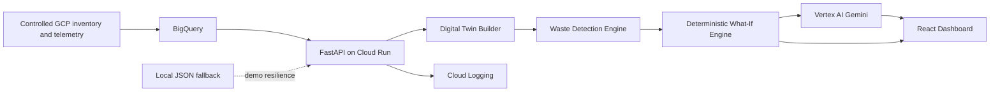

# EcoTwin — Checkpoint 2 BUILD Plan

**Program:** Patchamomma 2026  
**Checkpoint deadline:** August 28, 2026  
**Plan prepared:** August 27, 2026 (IST)  
**Checkpoint objective:** Prove the idea is implemented with one reliable, end-to-end, deployed flow.

## Implementation status - August 27, 2026

- [x] Delivery foundation: FastAPI, configuration, Docker, CI, security exclusions and automated tests.
- [x] Cloud data foundation: controlled dataset, validation, BigQuery loader, live `ecotwin_demo` dataset and read-only data APIs.
- [x] Digital twin builder: deterministic nine-node/seven-edge snapshot, API and interactive evidence panel.
- [x] Waste detection engine: three explainable detectors, evidence cards and threshold-boundary tests.
- [x] What-if simulation engine: deterministic cost, carbon, performance, risk and confidence result.
- [ ] Gemini explanation.
- [ ] Interactive frontend.
- [ ] Cloud Run deployment and final evidence package.

The completed cloud foundation uses project `ecotwin-sustainability-2026`, location `us-central1`, and data version `demo-2026-08-27-v1`. See [cloud foundation evidence](docs/evidence/cloud-foundation.md).

## 1. Winning product story

**Pitch:** EcoTwin creates a read-only digital twin of cloud infrastructure, detects likely waste, and lets an engineer test an optimization before touching production. It returns an auditable estimate of monthly cost, operational carbon, performance headroom, and risk. Gemini converts those computed results into a clear recommendation; it never invents the numbers.

**Tomorrow's proof:**

> Cloud Data → Digital Twin → Detect Waste → Choose Recommendation → Simulate → Compare Cost, Carbon, Performance, and Risk → Gemini Explanation

**Checkpoint 2 scope boundary:** EcoTwin is a decision-support prototype. It does not resize, stop, or delete real resources. The UI must visibly say **Simulation only — no production changes**.

## 2. Ruthless scope: P0, P1, and later

### P0 — required for the August 28 submission

- One deployed Cloud Run URL.
- One polished dashboard with 8–12 controlled GCP-like resources.
- A topology view with resource dependencies.
- Three working detectors: idle compute, over-provisioned compute, and storage waste.
- One excellent VM-rightsizing simulation, such as 4 vCPU → 2 vCPU.
- Before/after cost, carbon, predicted CPU pressure, risk, and confidence.
- Gemini explanation generated from the deterministic simulation JSON.
- BigQuery-backed inventory and telemetry, with a local JSON fallback.
- GitHub repository, README, architecture diagram, API docs, test evidence, and screenshots.
- Clear labels distinguishing controlled data, estimated metrics, and measured source fields.

### P1 — add only after the P0 flow is stable

- Filters by project, region, service, and waste type.
- Second simulation type: delete an unattached disk.
- Downloadable simulation evidence as JSON.
- Methodology drawer with formulas, thresholds, assumptions, and model version.
- A short comparison of two candidate regions.

### Not for Checkpoint 2

- Autonomous remediation.
- Multi-cloud support.
- Kubernetes optimization.
- Forecasting or reinforcement learning.
- Full live Cloud Billing export and Carbon Footprint export.
- Agent orchestration, vector databases, or elaborate RAG.

These belong in Checkpoint 3 only after the primary demo is dependable.

## 3. User journey and screen contract

### Screen A — Overview

Display:

- Total resources.
- Estimated current monthly cost.
- Estimated monthly operational carbon.
- Number of optimization opportunities.
- Potential monthly savings and carbon reduction.
- Data mode badge: `CONTROLLED_DEMO` or `GCP_CONNECTED`.
- Last ingestion time and methodology version.

Primary action: **Explore Digital Twin**.

### Screen B — Digital Twin

Display a dependency graph such as:

`Load Balancer → web-vm-01 → orders-db → orders-disk`

Node color communicates state:

- Green: healthy.
- Amber: over-provisioned.
- Red: idle or unattached.
- Grey: no recommendation.

Selecting a node opens its facts, telemetry, dependencies, recommendation, and evidence.

### Screen C — Waste Opportunities

Show three cards or rows:

1. **Idle resource:** `batch-worker-02`, CPU mean 2.1%, CPU p95 4.8%, negligible network for seven days.
2. **Over-provisioned resource:** `api-vm-01`, 4 vCPU, CPU p95 31%, candidate 2 vCPU.
3. **Storage waste:** `orphan-disk-01`, 200 GB, unattached for 21 days.

Every result must show:

- Detector reason.
- Evidence window.
- Suggested action.
- Estimated monthly savings.
- Confidence and limitations.

Primary action: **Simulate**.

### Screen D — What-If Simulator

For the hero scenario, provide:

- Current configuration: 4 vCPU, 16 GB RAM.
- Proposed configuration: 2 vCPU, 8 GB RAM.
- Optional utilization-growth buffer, default 20%.
- Simulate button.

Result cards:

- Monthly cost: before, after, delta, percent.
- Operational carbon: before, after, delta, percent.
- Performance proxy: current CPU p95 and predicted CPU p95.
- Risk: LOW / MEDIUM / HIGH plus reasons.
- Confidence: HIGH / MEDIUM / LOW.

Also show assumptions, formula version, and a unique simulation ID.

### Screen E — Gemini Recommendation

Gemini returns four short sections:

- Recommendation.
- Why the result is safe or risky.
- Validation steps before implementation.
- Rollback trigger.

It must cite only fields supplied in the simulation JSON. If Gemini is unavailable, show a deterministic fallback explanation so the demo still completes.

## 4. Reference architecture



### Deployment decision

Use one container and one Cloud Run service for Checkpoint 2:

- React/Vite builds static assets.
- FastAPI serves `/api/*` and the built frontend.
- BigQuery stores the controlled dataset and simulation history.
- Vertex AI Gemini is called with the Cloud Run service account through Application Default Credentials.
- No API key is stored in code, GitHub, the browser, or frontend JavaScript.

This keeps the architecture genuinely on Google Cloud while minimizing deployment failure points.

## 5. Module-by-module build plan

### Module 0 — Repository and delivery foundation

**Purpose:** Make the project buildable, testable, and judge-ready.

**Create:**

```text
ecotwin/
  backend/
    app/
      main.py
      config.py
      models/
      routers/
      services/
      repositories/
    tests/
  frontend/
    src/
      components/
      pages/
      services/
      types/
  data/
    resources.json
    telemetry.json
    pricing.json
    carbon_factors.json
  infra/
    bigquery/
    cloudrun/
  docs/
    architecture.md
    methodology.md
    evidence/
  Dockerfile
  cloudbuild.yaml
  .env.example
  .gitignore
  README.md
  LICENSE
```

**Rules:**

- Never commit secrets, project credentials, billing exports, or personal data.
- Commit small milestones with meaningful messages.
- Include a one-command local start and one-command test.
- Record the deployed revision and demo dataset version in the README.

**Acceptance:** A clean clone builds locally and `GET /api/health` returns `ok`.

### Module 1 — Controlled cloud data and BigQuery

**Purpose:** Give the prototype realistic, reproducible input without waiting for slow or unavailable production telemetry.

**Dataset:** `ecotwin_demo`

**Tables:**

1. `resources`
   - `resource_id`, `name`, `project_id`, `service_type`, `region`, `zone`
   - `machine_type`, `vcpu`, `memory_gb`, `storage_gb`, `storage_type`
   - `status`, `attached_to`, `labels`, `source`, `observed_at`
2. `telemetry_daily`
   - `resource_id`, `date`, `cpu_mean_pct`, `cpu_p95_pct`
   - `memory_mean_pct`, `memory_p95_pct`, `network_gb`, `disk_used_pct`
3. `dependencies`
   - `source_resource_id`, `target_resource_id`, `relationship`
4. `price_cards`
   - `sku_key`, `region`, `unit`, `usd_per_unit_hour`, `effective_date`, `source_url`
5. `carbon_factors`
   - `region`, `gco2e_per_kwh`, `pue`, `effective_date`, `source_url`
6. `simulation_runs`
   - `simulation_id`, `resource_id`, `request_json`, `result_json`
   - `method_version`, `data_version`, `created_at`

**Controlled demo data must include:**

- Two healthy VMs.
- One idle VM.
- One over-provisioned 4-vCPU VM.
- One attached disk.
- One unattached disk.
- One database node and dependencies.

**Important label:** `source = CONTROLLED_DEMO`. Never present synthetic data as live production data.

**Fallback:** If BigQuery is unavailable, use the same schemas from local JSON. The header must change to `LOCAL_DEMO_FALLBACK`.

**Acceptance:** API returns the same resource IDs and detector results from BigQuery and fallback modes.

### Module 2 — Digital twin builder

**Purpose:** Convert flat inventory into a graph the user can reason about.

**Backend output:**

```json
{
  "nodes": [{"id": "vm-api-01", "type": "compute", "status": "overprovisioned"}],
  "edges": [{"source": "lb-01", "target": "vm-api-01", "relationship": "routes_to"}],
  "snapshot_at": "2026-08-27T00:00:00Z",
  "data_mode": "CONTROLLED_DEMO"
}
```

**Implementation:**

- Normalize provider fields into a stable internal resource model.
- Validate that all edge endpoints exist.
- Add computed node state from detector results.
- Keep twin snapshots immutable during a simulation.

**Acceptance:** Graph renders at least six nodes and four meaningful dependencies; selecting a node opens its evidence panel.

### Module 3 — Waste detection engine

**Purpose:** Produce explainable recommendations using explicit rules.

#### Detector A — idle compute

Default rule over the last seven complete days:

```text
cpu_mean_pct < 5
AND cpu_p95_pct < 10
AND network_gb < configured low-network threshold
```

Recommendation: stop or schedule shutdown after owner validation.

#### Detector B — over-provisioned compute

```text
cpu_p95_pct < 40
AND memory_p95_pct < 60
AND not idle
AND sample_days >= 7
```

Recommendation: simulate one size smaller, maintaining at least 20% projected headroom.

#### Detector C — storage waste

```text
attached_to IS NULL
AND unattached_days >= 7
```

Optional secondary rule: `disk_used_pct < 20` with lower confidence.

**Each finding returns:** detector ID, severity, reason, evidence, proposed action, confidence, and simulation eligibility.

**Acceptance tests:**

- Boundary cases at 5%, 10%, 40%, and 60%.
- Insufficient data produces `LOW_CONFIDENCE`, not a confident recommendation.
- Healthy resources generate no finding.
- Rules are deterministic and versioned as `detector-v1.0`.

### Module 4 — What-if simulation engine

**Purpose:** Compute the numbers judges can verify.

**Principle:** Code calculates; Gemini explains.

#### Cost model

For a compute resource:

```text
monthly_compute_cost = hourly_compute_price × 730
monthly_storage_cost = storage_gb × storage_price_per_gb_month
monthly_total = monthly_compute_cost + monthly_storage_cost
cost_delta = proposed_monthly_total - current_monthly_total
```

For Checkpoint 2, use versioned price cards with source URL and effective date. Do not claim they are a live invoice forecast.

#### Operational-carbon estimate

Use a transparent engineering estimate:

```text
estimated_kwh = runtime_hours × estimated_average_kw × PUE
estimated_gco2e = estimated_kwh × regional_grid_factor_gco2e_per_kwh
carbon_delta = proposed_gco2e - current_gco2e
```

The power estimate may combine vCPU, utilization, and memory coefficients. Keep coefficients in configuration, not UI code. Call the result **estimated operational carbon**, not Google Cloud's official customer Carbon Footprint value.

#### Performance proxy for CPU rightsizing

```text
predicted_cpu_p95 = min(100, current_cpu_p95 × current_vcpu / proposed_vcpu × growth_buffer)
headroom_pct = 100 - predicted_cpu_p95
```

This is a capacity proxy, not a load test. State that limitation.

#### Risk policy

- LOW: predicted CPU p95 ≤ 65%, memory headroom ≥ 25%, at least seven days of telemetry.
- MEDIUM: predicted CPU p95 65–80%, or incomplete memory evidence.
- HIGH: predicted CPU p95 > 80%, dependency is critical, or evidence window is insufficient.

Dependency criticality can only increase risk, never decrease it.

#### Confidence policy

- HIGH: ≥14 days, no missing days, stable workload.
- MEDIUM: 7–13 days or moderate variability.
- LOW: <7 days, missing memory, or volatile workload.

**Result contract:**

```json
{
  "simulation_id": "sim_...",
  "action": "RIGHTSIZE_VM",
  "before": {"vcpu": 4, "monthly_cost_usd": 120, "carbon_kgco2e": 8.2},
  "after": {"vcpu": 2, "monthly_cost_usd": 68, "carbon_kgco2e": 4.9},
  "impact": {"cost_delta_usd": -52, "carbon_delta_kgco2e": -3.3},
  "performance": {"current_cpu_p95_pct": 31, "predicted_cpu_p95_pct": 68.2},
  "risk": {"level": "MEDIUM", "reasons": ["Predicted CPU p95 exceeds 65%"]},
  "confidence": "HIGH",
  "method_version": "simulation-v1.0",
  "data_version": "demo-2026-08-27"
}
```

The numbers above are illustrative; final demo values must come from the implemented engine.

**Acceptance:** Same request and same snapshot produce the same numeric result and method version.

### Module 5 — Gemini explanation

**Purpose:** Make simulation results actionable while preserving numerical integrity.

**Model choice:** Use a current Flash-class Gemini model available in the selected Vertex AI project and region. Keep the model ID configurable.

**Prompt contract:**

- System instruction: explain only the supplied JSON.
- Never calculate or change cost, carbon, utilization, risk, or confidence values.
- Mention that the result is a simulation.
- Return structured JSON with `summary`, `rationale`, `validation_steps`, `rollback_trigger`, and `limitations`.
- If a required field is missing, say so instead of guessing.

**Guardrails:**

- Validate response schema with Pydantic.
- Timeout after a few seconds.
- Retry once.
- Cache by simulation ID.
- Fall back to a deterministic template if Vertex AI fails.
- Store model name and prompt version, but never chain-of-thought.

**Service identity:** Grant the Cloud Run service account only the minimal Vertex AI invocation role and BigQuery read/job permissions it needs. Do not create a browser or frontend API key.

**Acceptance:** Gemini accurately references the engine values and the demo still works when the Gemini call is deliberately disabled.

### Module 6 — FastAPI backend

**Endpoints:**

```text
GET  /api/health
GET  /api/summary
GET  /api/resources
GET  /api/twin
GET  /api/opportunities
POST /api/simulations
GET  /api/simulations/{simulation_id}
POST /api/simulations/{simulation_id}/explain
GET  /api/methodology
```

**Controls:**

- Typed request/response models.
- Input validation for vCPU, memory, resource type, and supported actions.
- Correlation ID and structured logs.
- Bounded query results and BigQuery parameterized queries.
- CORS disabled if frontend and API share one origin.
- No mutation endpoint for real infrastructure.
- Friendly error payload with a non-sensitive request ID.

**Acceptance:** OpenAPI loads, invalid requests return 4xx, and core endpoints pass unit/integration tests.

### Module 7 — Frontend and visual design

**Stack:** React, TypeScript, Vite, Tailwind or a small token-based CSS system, Recharts, and React Flow.

**Visual direction:** calm climate-tech aesthetic—deep navy, forest green, off-white, limited amber/red for risk. Avoid a generic admin-template look.

**Required UX:**

- Hero metric cards.
- Clear progress flow across the top.
- Interactive dependency graph.
- Evidence-first waste cards.
- Before/after comparison, with both absolute and percentage delta.
- Prominent simulation-only badge.
- Methodology and data-source badges.
- Skeleton, empty, and error states.
- Responsive at 1366×768 and readable on mobile.
- Accessible labels, focus states, sufficient contrast, and no color-only meaning.

**Demo resilience:** Never leave the user on a spinner. Surface fallback mode visibly and continue.

**Acceptance:** A new viewer can complete the hero flow without instructions in under 90 seconds.

### Module 8 — Google Cloud deployment

**Services to enable:**

- Cloud Run
- Cloud Build
- Artifact Registry
- BigQuery
- Vertex AI
- Cloud Logging

Secret Manager is optional because workload identity should remove the need for an API key.

**Deployment settings:**

- One Cloud Run service.
- Minimum instances: 0 for cost control; temporarily set 1 only for the recorded/live demo if cold start is a problem.
- Maximum instances: 2–3.
- Concurrency: default unless measured otherwise.
- Public unauthenticated access only for the demo service, with no private project data.
- Dedicated least-privilege service account.
- Labels: `app=ecotwin`, `stage=checkpoint2`, `owner=<team>`.
- Region chosen for service availability, latency, and documented carbon rationale.

**Evidence to capture:**

- Cloud Run service page and live URL.
- Successful revision and timestamp.
- BigQuery dataset/tables with controlled-data labels.
- Vertex AI API use or successful Gemini log event.
- Architecture diagram.
- Cloud Logging request with secrets and payloads excluded.

**Acceptance:** Live URL works in an incognito browser and the complete flow succeeds twice consecutively.

### Module 9 — Testing, validation, and evidence

**Automated:**

- Detector unit tests.
- Simulation formula unit tests.
- API integration test for the hero path.
- Frontend build/type check.
- Health check.

**Golden scenario:**

Store one frozen input and expected output. The README should show the exact command that reproduces it.

**Manual validation:**

- Recalculate one cost example in a spreadsheet or README table.
- Recalculate one carbon example from the documented coefficients.
- Show risk changes from LOW/MEDIUM to HIGH when the growth buffer increases.
- Disable Gemini and show deterministic fallback.
- Disable BigQuery access locally and show JSON fallback.

**Checkpoint evidence pack:**

- `docs/evidence/01-dashboard.png`
- `docs/evidence/02-digital-twin.png`
- `docs/evidence/03-waste-detection.png`
- `docs/evidence/04-simulation.png`
- `docs/evidence/05-gemini.png`
- `docs/evidence/06-cloud-run.png`
- `docs/evidence/07-bigquery.png`
- `docs/evidence/test-results.txt`

### Module 10 — Documentation and submission

**README order:**

1. One-line value proposition.
2. Live demo link and short GIF/screenshot.
3. Problem and target user.
4. The 60-second flow.
5. Architecture.
6. What is real, controlled, and estimated.
7. Setup and deployment.
8. Methodology and limitations.
9. Test results.
10. Google Cloud services used.
11. Privacy/security design.
12. Roadmap to Checkpoint 3.

**Submission language:** Say “controlled GCP-shaped telemetry backed by BigQuery” until real telemetry is connected. Say “estimated operational carbon” rather than “actual emissions.” Never claim guaranteed savings.

## 6. API-to-UI traceability

| User step | Backend/API | Visible proof |
|---|---|---|
| Open dashboard | `GET /api/summary` | Cost, carbon, opportunity totals |
| View architecture | `GET /api/twin` | Nodes and dependency edges |
| Detect waste | `GET /api/opportunities` | Three detector types with evidence |
| Select 4→2 vCPU | `POST /api/simulations` | Deterministic before/after result |
| Assess safety | Simulation result | Performance proxy, risk, confidence |
| Ask Gemini | `POST /.../explain` | Recommendation and validation plan |
| Audit result | `GET /api/simulations/{id}` | Run ID, data version, method version |

## 7. One-day execution schedule for August 27–28

The order below is a dependency order. Do not polish a later module while an earlier acceptance test is failing.

### Block 1 — 60 minutes: freeze scope and foundation

- Create repository structure and README skeleton.
- Freeze the hero resource, thresholds, price cards, and carbon factors.
- Create `/health` and the local JSON repository.
- Write the golden scenario before UI work.

**Exit gate:** A single backend test returns a deterministic simulation JSON.

### Block 2 — 2.5 hours: backend core

- Implement resource models, twin builder, three detectors, and simulation engine.
- Add methodology metadata and simulation ID.
- Add unit tests at threshold boundaries.

**Exit gate:** All P0 APIs work locally; tests are green.

### Block 3 — 2.5 hours: primary UI

- Implement overview, graph, opportunity panel, simulator, and result comparison.
- Add explicit data-mode and simulation-only badges.
- Use final sample copy, not lorem ipsum.

**Exit gate:** Hero flow completes in the browser without Gemini.

### Block 4 — 60–90 minutes: BigQuery and Gemini

- Create the six small BigQuery tables and load controlled data.
- Switch backend repository to BigQuery with automatic fallback.
- Add Vertex AI Gemini structured explanation with deterministic fallback.

**Exit gate:** Data source badge says `CONTROLLED_DEMO / BIGQUERY`, and explanation loads.

### Block 5 — 60–90 minutes: Cloud Run deployment

- Create dedicated service account and minimal IAM.
- Deploy one container to Cloud Run.
- Set maximum instances and labels.
- Run the complete flow twice on the public URL.

**Exit gate:** A clean/incognito session completes the hero flow.

### Block 6 — 90 minutes: evidence and submission

- Capture seven screenshots.
- Record a 2–3 minute demo.
- Finish README, architecture, method limitations, and setup commands.
- Tag the submission commit/release.
- Verify every submitted link from a logged-out browser.

**Stop rule:** Preserve at least 45 minutes before the deadline for upload/link failures. No new features during that window.

## 8. Demo script (2 minutes 30 seconds)

**0:00–0:20 — Problem**  
“Cloud teams see bills and monitoring charts, but optimization in production is risky. EcoTwin lets them test a change first.”

**0:20–0:40 — Dashboard**  
Show resource, cost, estimated carbon, and waste totals. Point to controlled-data and methodology labels.

**0:40–1:05 — Digital twin and detection**  
Select `api-vm-01`. Show dependencies and why it is considered over-provisioned. Briefly show the idle VM and unattached disk to prove all three detectors.

**1:05–1:40 — Hero simulation**  
Choose 4→2 vCPU and click Simulate. Read the before/after cost and carbon delta, predicted p95, risk, confidence, simulation ID, and method version.

**1:40–2:00 — Gemini**  
Show the recommendation, validation plan, and rollback trigger. State: “The engine computes; Gemini explains.”

**2:00–2:20 — Google Cloud proof**  
Show Cloud Run deployment, BigQuery-backed snapshot, and architecture.

**2:20–2:30 — Close**  
“EcoTwin makes cloud sustainability decisions measurable, explainable, and safer before production changes.”

## 9. Budget guardrail for the $300 credits

Checkpoint 2 should consume only a small fraction of the credits. Treat the figures below as planning caps, not exact invoices.

| Area | Checkpoint 2 working cap | Control |
|---|---:|---|
| Cloud Run + build traffic | $10 | min instances 0, max 2–3, one service |
| Artifact Registry / build storage | $5 | retain only necessary images |
| BigQuery | $5 | tiny tables, partition simulation history, avoid `SELECT *` |
| Vertex AI Gemini | $15 | Flash model, short structured prompts, caching, call only after simulation |
| Logging | $5 | structured concise logs, no debug flood or payload bodies |
| Contingency | $10 | deployment retries and demo traffic |
| **Target cap** | **$50** | preserve at least $250 for Checkpoint 3 |

Set budget alerts at $10, $25, and $50. A Google Cloud budget alert is not a hard spending cap, so also enforce service quotas, low maximum instances, and log discipline.

## 10. Top-10 differentiators

1. **Auditable simulation:** Every output has a simulation ID, input snapshot, data version, and method version.
2. **Honest carbon accounting:** Carbon is explicitly an operational estimate with source, date, formula, and limitation—not greenwashing.
3. **Safety by design:** Read-only ingestion and no remediation endpoint in Checkpoint 2.
4. **AI in the correct role:** Gemini explains and challenges a computed result; it does not fabricate savings.
5. **Risk-aware recommendation:** Performance headroom and dependency criticality can block a superficially attractive saving.
6. **Resilient live demo:** BigQuery and Gemini each have a visible, deterministic fallback.
7. **Proof over slides:** Live URL, source, test output, Cloud Run revision, BigQuery data, and reproducible golden scenario.
8. **Clear evolution path:** Controlled telemetry now, read-only Cloud Monitoring/Billing/Carbon Footprint integration and validation experiments for Checkpoint 3.

## 11. Judge-facing quality gates

Use these as an internal rubric; they are not claimed to be official Patchamomma scoring criteria.

| Dimension | Evidence needed before submission |
|---|---|
| Problem clarity | One target persona, one painful decision, one sentence |
| Working implementation | Public URL and complete hero flow |
| Google Cloud depth | Cloud Run + BigQuery + Vertex AI, each visible and necessary |
| Technical credibility | Versioned formulas, tests, provenance, limitations |
| AI usefulness | Structured explanation and validation/rollback advice |
| Sustainability impact | Absolute and percentage cost/carbon delta |
| Safety and trust | Read-only, simulation-only, no secrets, confidence/risk |
| Demo quality | Under 3 minutes, no dead ends, legible at 1366×768 |

## 12. Risk register and fallbacks

| Risk | Prevention | Demo fallback |
|---|---|---|
| BigQuery IAM/query failure | validate service account early | local JSON with visible fallback badge |
| Gemini quota/latency | Flash model, compact prompt, cache, one retry | deterministic explanation template |
| Cloud Run cold start | small image; warm once before recording | recorded demo plus screenshots |
| Carbon number challenged | expose formula, sources, assumptions, version | call it estimated operational carbon |
| Pricing changes | source URL and effective date | qualify as scenario estimate |
| UI graph fails | validate edge endpoints | static list/dependency panel |
| Time runs short | P0 scope lock | cut filters, exports, region comparison |
| Secret leakage | ADC/service identity and secret scan | rotate before submission if detected |

## 13. Definition of done for Checkpoint 2

The checkpoint is ready only when all boxes are checked:

- [ ] Public Cloud Run URL loads without the developer's login.
- [ ] Dashboard visibly identifies the input as controlled demo data.
- [ ] Digital twin contains meaningful nodes and dependencies.
- [ ] Idle compute, over-provisioned compute, and storage waste are detected.
- [ ] 4→2 vCPU simulation returns deterministic cost, carbon, performance, risk, and confidence.
- [ ] Gemini explains the exact result and includes validation and rollback steps.
- [ ] Gemini and BigQuery fallback paths work.
- [ ] No production-mutation API exists.
- [ ] No secret is present in Git history, logs, screenshots, or frontend bundle.
- [ ] Tests pass and golden scenario is reproducible.
- [ ] README distinguishes observed, controlled, computed, and AI-generated information.
- [ ] Architecture and seven evidence artifacts are committed.
- [ ] Two successful end-to-end runs were completed from a clean browser.
- [ ] Demo is under three minutes and all submission links are accessible.

## 14. Checkpoint 3 bridge (do not build before P0 is stable)

After August 28:

- Add read-only Cloud Asset Inventory and Cloud Monitoring ingestion.
- Add controlled Cloud Billing export and, where eligible, Carbon Footprint export.
- Calibrate coefficients against observed or controlled experiments.
- Add uncertainty ranges instead of only point estimates.
- Validate rightsizing predictions with a load-test experiment.
- Add region/time-shift simulations where service constraints allow.
- Add approval workflow and exportable recommendation report.
- Improve evaluation: numerical faithfulness of Gemini, detector precision, and simulation error.
- Deploy an authenticated team version while retaining a safe public demo dataset.

## 15. Final product decisions to keep fixed

- **Primary user:** cloud engineer or FinOps/Sustainability engineer.
- **Primary resource:** Compute Engine-style VM.
- **Hero action:** rightsize 4 vCPU → 2 vCPU.
- **Primary proof:** reproducible before/after simulation.
- **AI role:** explanation, validation checklist, and rollback guidance.
- **Data posture:** controlled and honestly labeled for Checkpoint 2.
- **Safety posture:** read-only and simulation-only.
- **Deployment:** one Cloud Run service, BigQuery, and Vertex AI.
- **Spend target:** under $50 for Checkpoint 2; preserve credits for proof and validation.
