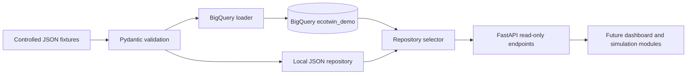

# EcoTwin foundation architecture

Modules 1–2 establish a provider-neutral catalog API backed by either BigQuery or the same validated local JSON dataset.

## Data-mode behavior

- `local`: always use validated local JSON.
- `bigquery`: require BigQuery and fail startup if it is unavailable.
- `auto`: prefer BigQuery when a project is configured; otherwise use local data and expose the fallback reason through `/api/data-status`.

The data source is always visible. Controlled data is never presented as measured production telemetry.

## Security boundary

- The API is read-only.
- No resource mutation endpoint exists.
- Cloud credentials are obtained through Application Default Credentials at runtime, not committed keys.
- BigQuery identifiers are validated before they are interpolated into table-qualified SQL.

