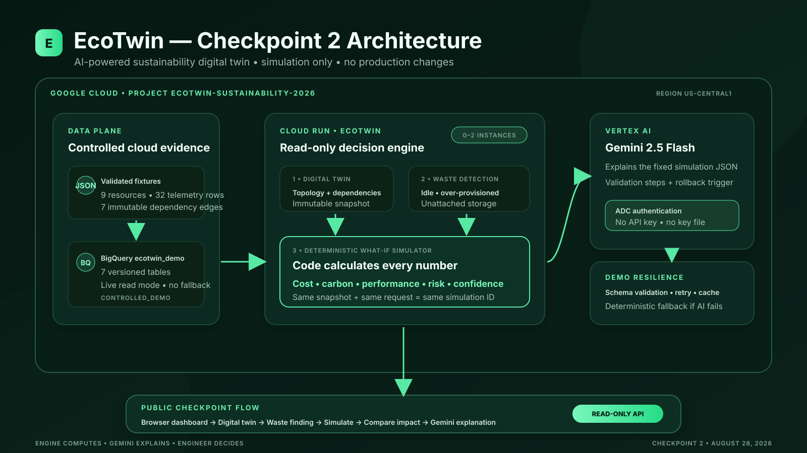

# EcoTwin — Checkpoint 2 BUILD submission

## Submission identity

**Title:** EcoTwin — AI-Powered Sustainability Digital Twin for Cloud Infrastructure

**One-liner:** An AI-powered digital twin that identifies cloud resource waste and simulates the cost, operational-carbon and performance impact of optimization decisions before they are applied to real infrastructure.

**Live application:** <https://ecotwin-1075889318331.us-central1.run.app>

**Source code:** <https://github.com/Akkimdivya/ecotwin-sustainability-digital-twin>

## Checkpoint 2 description

Cloud teams can see cost and utilization dashboards, but they still lack a safe way to understand the combined financial, sustainability and performance consequences of an infrastructure change. EcoTwin builds a read-only digital twin of cloud resources and dependencies, identifies explainable waste, and lets an engineer test a proposed right-size before touching production.

The working Checkpoint 2 prototype reads a controlled, versioned nine-resource dataset from BigQuery, builds a dependency graph, detects idle compute, over-provisioned compute and unattached storage, and runs a deterministic right-sizing simulation. It reports before/after cost, estimated operational carbon, projected CPU and memory pressure, confidence and risk. Gemini 2.5 Flash then explains the fixed simulation JSON and provides validation and rollback guidance. If Vertex AI is unavailable or returns invalid output, a deterministic fallback preserves the demo.

## Working hero flow

> Cloud Data → Digital Twin → Detect Waste → Select Recommendation → Simulate → Cost + Carbon + Performance + Risk → Gemini Explanation

Every step works in the deployed browser application. EcoTwin has no endpoint that stops, deletes or resizes a cloud resource.

## Demonstrated impact

The controlled `vm-api-01` scenario compares 4 vCPU/16 GB with 2 vCPU/8 GB:

| Measure | Current | Simulated | Impact |
|---|---:|---:|---:|
| Monthly cost | $102.82 | $53.91 | $48.91 saved / 47.6% |
| Operational carbon | 9.583 kgCO2e | 6.627 kgCO2e | 2.956 kgCO2e reduced / 30.8% |
| CPU p95 | 34.0% | 81.6% | exceeds safe boundary |
| Memory p95 | 48.0% | 100.0% | capacity exhausted |
| Decision risk | — | HIGH | do not implement directly |

The most important result is not the saving; it is the warning. A cost-only optimizer might recommend the smaller VM. EcoTwin exposes that the proposed change is unsafe under the configured growth buffer and dependency criticality.

## Google Cloud implementation

- Cloud Run hosts the public FastAPI service and frontend in `us-central1`.
- BigQuery stores seven versioned controlled-data tables in `ecotwin_demo`.
- Vertex AI serves `gemini-2.5-flash` structured explanations in location `global`.
- Artifact Registry stores the production image built by Cloud Build.
- Application Default Credentials authenticate the runtime; no API key or downloaded credential is used.
- The dedicated runtime service account has only BigQuery Data Viewer, BigQuery Job User and Vertex AI User roles.
- Service-level autoscaling is limited to zero through two instances for cost control.

## Why Gemini is useful here

EcoTwin deliberately separates calculation from explanation:

- deterministic code owns every cost, carbon, utilization, confidence and risk value;
- Gemini receives the complete simulation JSON and may only explain it;
- Pydantic validates the structured response;
- the output includes a validation checklist and rollback trigger;
- timeout, retry, cache and deterministic fallback protect the demo;
- the provider and model are visible in the UI.

This makes the AI useful without allowing it to fabricate the business case.

## Validation evidence

- 16 automated backend tests pass.
- Ruff lint passes.
- The Docker image builds and runs locally.
- GitHub Actions is green through run #8.
- Production health reports `data_mode: bigquery`.
- Production data status reports nine resources with no fallback.
- Production AI status reports Vertex AI, `gemini-2.5-flash`, ADC and no API key.
- The public browser completed the full hero flow and displayed `Vertex AI / gemini-2.5-flash`.
- An intentionally truncated model response was rejected and safely replaced by the deterministic fallback.

## Honest scope statement

Checkpoint 2 uses a clearly labeled controlled dataset and versioned scenario assumptions. Cost values are not invoices, carbon values are estimated operational emissions, and the performance model is a capacity proxy rather than a production load test. EcoTwin is decision support; an engineer remains responsible for validation and change approval.

## 30-second pitch

Cloud optimization tools often tell you what to change, but not what could break. EcoTwin creates a sustainability digital twin of cloud resources, finds waste, and lets engineers test an optimization before touching production. In our live scenario it identifies 47.6% potential savings and 30.8% estimated operational-carbon reduction—but also predicts CPU and memory pressure and correctly marks the change HIGH risk. Deterministic code calculates every number; Gemini turns the result into an actionable validation and rollback plan. EcoTwin helps teams optimize safely, not blindly.

## Evidence links

- [Production deployment evidence](../evidence/cloud-run-deployment.md)
- [Cloud and BigQuery evidence](../evidence/cloud-foundation.md)
- [Gemini safety contract](../gemini-explanation.md)
- [Simulation methodology](../simulation.md)
- [Waste-detection methodology](../waste-detection.md)
- [Timed demo script](demo-script.md)
- [Submission checklist](submission-checklist.md)
