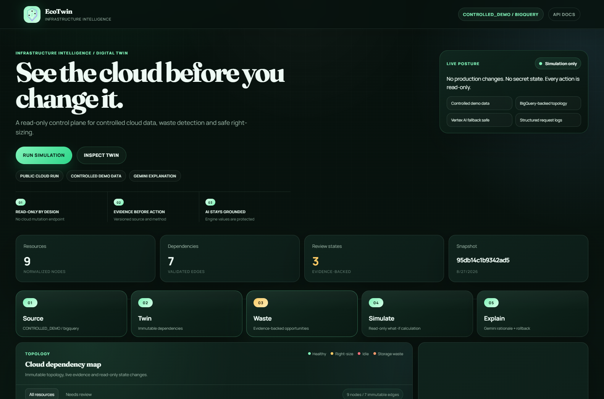
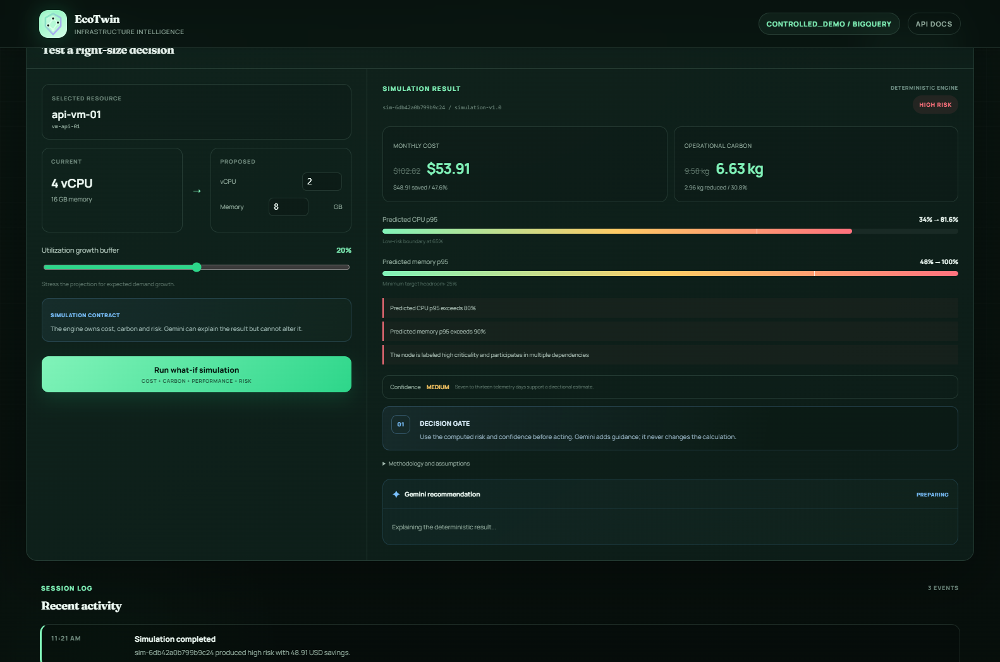
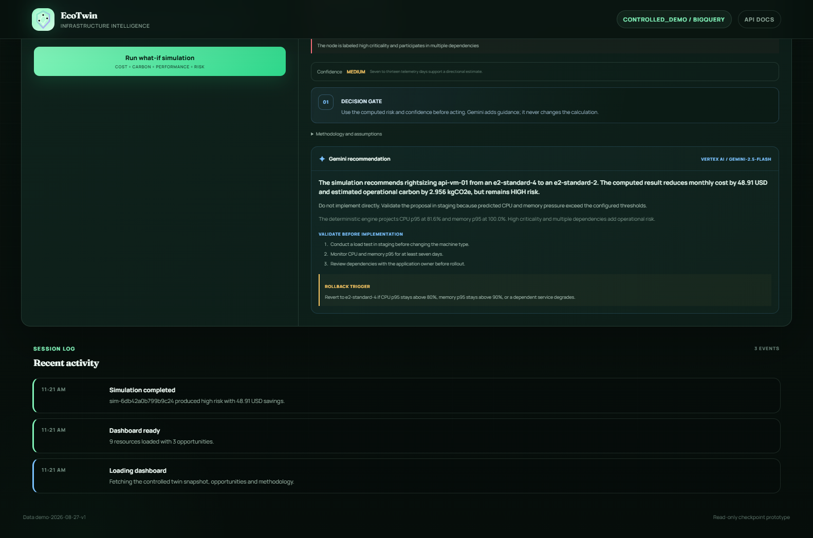
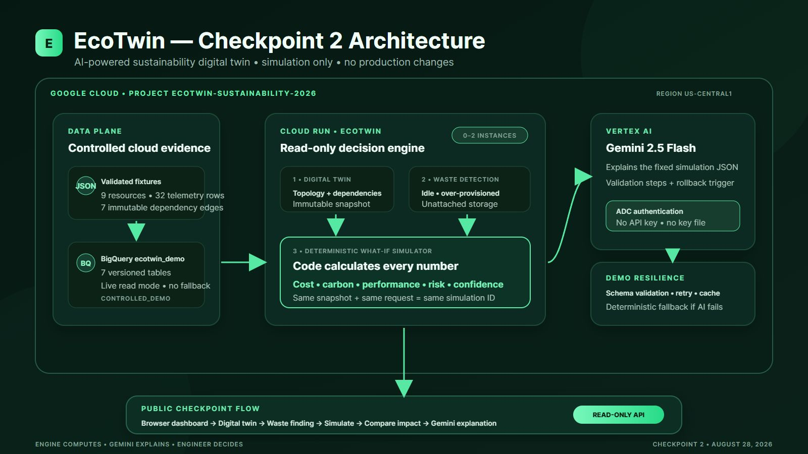

# Checkpoint 2 evidence index

## Strongest screenshots

### 1. Live BigQuery digital twin and decision guarantees

Shows the deployed `CONTROLLED_DEMO / BIGQUERY` source badge, the read-only/evidence/grounded-AI proof rail, the five-stage decision flow and the live topology workspace.

### 2. Deterministic impact and decision gate

Shows the 4-to-2-vCPU scenario, `$53.91` simulated monthly cost, `6.63 kg` estimated operational carbon, CPU/memory pressure, HIGH-risk reasons, deterministic-engine status and the rule that Gemini cannot alter the calculation.

### 3. Gemini validation plan and rollback trigger

Shows the Gemini provider label, high-risk warning, validation checklist and explicit rollback trigger alongside the deterministic decision gate.

### 4. Production architecture

Shows the Google Cloud boundary, BigQuery data plane, Cloud Run decision engine, deterministic simulator, Vertex AI explanation layer, ADC identity and fallback path.

## Machine-verifiable evidence

- [Cloud Run deployment evidence](../evidence/cloud-run-deployment.md)
- [Google Cloud and BigQuery evidence](../evidence/cloud-foundation.md)
- [Gemini explanation contract](../gemini-explanation.md)
- [Simulation methodology](../simulation.md)
- [Waste detection methodology](../waste-detection.md)

## Public links

- Live application: <https://ecotwin-1075889318331.us-central1.run.app>
- API documentation: <https://ecotwin-1075889318331.us-central1.run.app/docs>
- GitHub repository: <https://github.com/Akkimdivya/ecotwin-sustainability-digital-twin>
